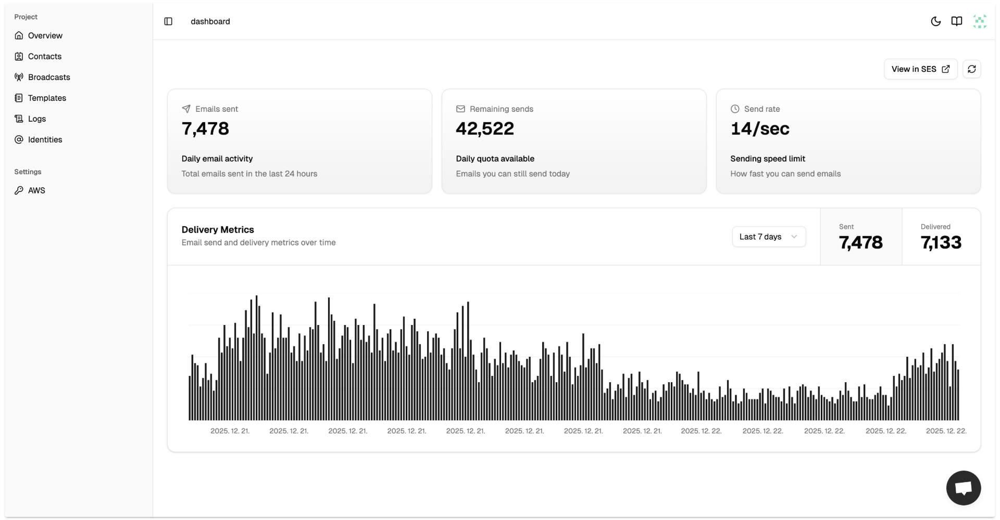

**Get Resend/Postmark/Sendgrid on Your AWS in Minutes**

Connect your AWS SES, get a complete email platform. Broadcast campaigns, manage contacts, and track every email—all at AWS pricing.

## Features

- ✉️ **Smart Rate Limiting** - Adjust sending capacity to stay within AWS SES limits and avoid affecting other email operations in your account.
- 📝 **Notion-Style Email Editor** - Write emails with our intuitive block-based editor. Drag, drop, and style your content without touching code.
- 📇 **Manage Millions of Contacts** - Bulk upload massive contact lists via CSV files. Import millions of contacts in minutes, not hours.
- 📊 **Real-Time Tracking** - Monitor delivery, opens, clicks, and bounces in real-time. Know exactly what's happening with emails you send.
- 📧 **Email Template** - Build once, reuse everywhere. Save time with templates that update emails in real-time.

## Get Started

Visit [https://www.getsendbase.com](https://www.getsendbase.com) to get started.

## Need Help?

- [Community](https://github.com/email-for-indiehackers/.github/discussions) - feature requests, bug reports, general questions.
- [Twitter](https://x.com/getsendbase) - updates, tips, and community highlights.

---

- ❤️ Love Sendbase?
- ⭐️ Click the star button
